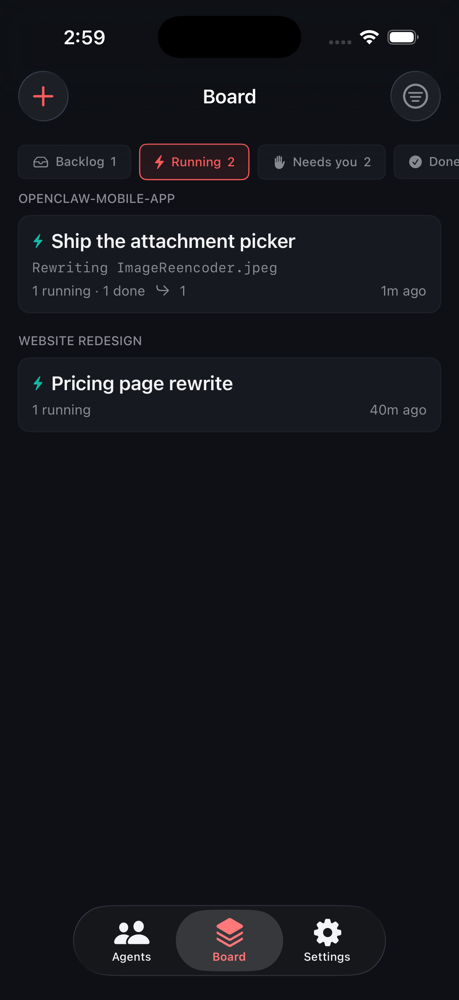

# OpenClaw Mobile

A phone-first iOS client for talking to the autonomous [OpenClaw](https://docs.openclaw.ai)
agents running on **your own** gateway — your Mac, your server, your network. There is no
account, no cloud service in the middle, and nothing routes through anyone else.



## What it does

- **Talk to every agent from one place.** A roster of the agents on your gateway, each with
  its own thread, all over a single shared connection.
- **A chat built for developers.** Code blocks with Copy, a live tool-call timeline showing
  what the agent actually ran, Stop on a running reply, and Retry on a failed send.
- **Send it context.** Photos, camera shots, and files go up as native attachments; small
  text and source files are pasted inline as code so the agent reads them directly.
- **Dictate instead of typing**, on-device where your language supports it.
- **A Board of everything in flight.** Every agent session as a Kanban card, grouped into
  project lanes the app derives from your worktrees and working directories. Archive, move,
  start, stop, and cancel from a long-press.
- **Create, edit, and delete agents** from the phone.

Not in this version: cockpit/terminal control, push notifications, and multiple gateways.

## What you need

1. **A running OpenClaw gateway** (protocol v4) on a machine you control.
2. **A way to reach it from the phone.** A Cloudflare Tunnel is the easy path and gives you a
   `wss://…` URL. See `designs/2026-07-22-stable-tunnel-onepager-guide.md`.
3. **Xcode 16+** with an iOS 17 simulator, and [XcodeGen](https://github.com/yonaskolb/XcodeGen)
   (`brew install xcodegen`). A device build additionally needs an Apple developer team; the
   simulator does not.

## Pair the phone to your gateway

The phone gets its own signing key. Your gateway approves that key once, and from then on the
device can read and send as you.

1. On the gateway, print a setup code:
   ```bash
   openclaw qr
   ```
2. In the app, open **Settings → Scan Setup Code**, or paste the code into the field below it.
3. The gateway asks you to approve the new device:
   ```bash
   openclaw devices approve --latest
   ```
4. The app shows **Paired**, and the roster fills with your agents.

Setup codes expire after a few minutes, and a Quick Tunnel URL changes every time the tunnel
restarts. If pairing fails, the screen names the specific fix.

Without a gateway configured the app runs in **demo mode** with a canned roster, thread, and
board, so you can look around before committing to anything.

## Build and run

```bash
# Generate the Xcode project (required after editing project.yml)
cd OpenClawMobile && xcodegen generate && cd ..

# Run the tests. Do NOT add CODE_SIGNING_ALLOWED=NO — it strips the app's entitlements,
# every Keychain write then fails with -34018, and the device identity is re-minted on
# every launch so pairing can never persist. CI was green for months with that bug.
xcodebuild test -project OpenClawMobile/OpenClawMobile.xcodeproj \
  -scheme OpenClawMobile \
  -destination 'platform=iOS Simulator,name=iPhone 17 Pro'

# Build and launch in the simulator
xcodebuild build -project OpenClawMobile/OpenClawMobile.xcodeproj \
  -scheme OpenClawMobile \
  -destination 'platform=iOS Simulator,name=iPhone 17 Pro' \
  -derivedDataPath /tmp/ocm
xcrun simctl install booted /tmp/ocm/Build/Products/Debug-iphonesimulator/OpenClawMobile.app
xcrun simctl launch booted com.openclaw-gv.mobile
```

Open `OpenClawMobile/OpenClawMobile.xcodeproj` in Xcode and hit Run for the usual workflow.

## Check the gateway directly

When something looks wrong, talk to the gateway without the app in the way:

```bash
node tools/phase0-verify.mjs <host> [token] [--pair <setupCode>]   # handshake + pairing ladder
node tools/rpc-probe.mjs <host> <method> '<jsonParams>'            # one RPC, prints the payload
```

## How it is built

Swift and SwiftUI, iOS 17+, one app target, **zero third-party dependencies** — URLSession,
CryptoKit, Keychain, and Foundation only. MVVM with `@Observable` view models over a thin
service layer, one shared WebSocket for the whole app, and a design system where every colour
and radius lives in one file and a test fails the build if one escapes.

Deeper reading: [`CLAUDE.md`](CLAUDE.md) for the working agreement, and `designs/` for the
architecture, protocol, and feature specs.

## License

Not yet licensed for redistribution.
