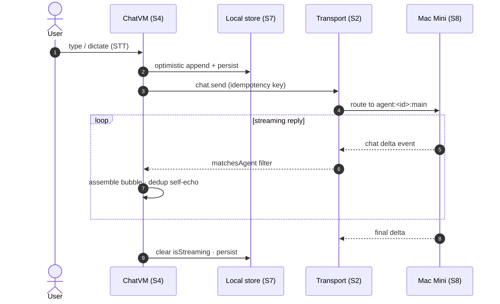
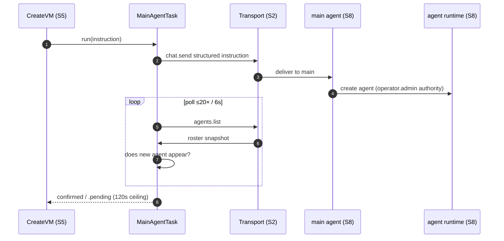

# OpenClaw Mobile — System Architecture (zoomed-out)

**Date:** 2026-07-23
**Scope:** Compartmentalize the whole product into big chunks (auth, transport,
chat, agents, surfaces/"app store", local store, gateway, backend) and name each
chunk's responsibility, interface, dependencies, and where it physically lives.
This is a map for reasoning about blast radius and build order — not an
implementation plan.

---

## 0. The load-bearing facts

Everything below bends around three constraints:

**F0.1 — Origin is always the client.** Every flow *originates on the phone*.
The phone opens the socket, authenticates, subscribes, and sends. The only
server→client traffic is the **event stream**, and even that rides a
subscription the phone opened. There is no server-initiated channel to a
sleeping phone (this is exactly what push/S9 would add). Design consequence:
if the phone isn't driving, nothing happens.

**F0.2 — The Mac Mini is one unified node.** Server + storage + agent
environment are the **same machine**. The "gateway" (protocol-v4 RPC server),
the agents' runtime/filesystem, the session-history store, and any future
upload storage or push-notifier all live on that one box. We **own** it — there
is no separate cloud backend to build; "the backend" and "the box the agents
run on" are one and the same.

**F0.3 — The phone holds only `operator.read` + `operator.write`.** Admin
operations (`agents.create/update/delete`, `agents.files.set`, `terminal.*`)
are `operator.admin` — the phone CANNOT call them. So the phone is always a
**requester**; privileged work is done by the **`main` agent** (runs in-process
on the Mac Mini with full local authority) via a structured `chat.send`
instruction the phone then polls to confirm ("approach B").

> ⚠️ **F0.3 is asserted, not proven** — `.docs/protocol.md §10` lists the exact
> scope for `agents.create/update/delete` as an *open unknown*. Verify with
> `tools/rpc-probe.mjs` before building further on approach B (review finding F1).

---

## 1. Compartment map

Legend: **green** = live · **amber** = partial · **grey** = not built.
All arrows originate on the client (F0.1); the Mac Mini is one owned box (F0.2).

```mermaid
flowchart TB
    subgraph CLIENT["iOS APP (client) — every flow originates here (F0.1)"]
        direction TB
        S6["S6 · Surfaces / &quot;app store&quot;<br/>(Kanban, Reviewer…)"]
        S4["S4 · CHAT<br/>the current investment"]
        S5["S5 · Agents / Roster<br/>approach-B executor"]
        S2["S2 · Transport + Protocol<br/>GatewayConnection actor<br/>one socket · SyncSource seam"]
        S1["S1 · Auth / DeviceTrust<br/>Ed25519 · pairing · scoped token"]
        S7["S7 · Local store<br/>Keychain · UserDefaults · JSON cache"]
        S10["S10 · Design system"]
        OD["On-device services<br/>Speech (STT) · file render/share"]
    end

    subgraph MM["MAC MINI — one owned box: server + storage + agent env (F0.2)"]
        direction TB
        S8["S8 · Gateway server<br/>protocol-v4 WS RPC · scope enforcement"]
        MAIN["main agent<br/>(privileged executor, approach B)"]
        RT["agent runtime + environment"]
        STORE["storage / filesystem<br/>session history = source of truth<br/>agent files · (future) uploads"]
        S9["S9 · unbuilt capabilities ON this box<br/>push notifier (APNs) · upload intake<br/>cross-device fan-out"]
        S8 --- MAIN
        S8 --- RT
        S8 --- STORE
        MAIN --- RT
        RT --- STORE
    end

    S6 --> S4
    S6 --> S5
    S4 --> S2
    S5 --> S2
    S5 -. "approach B: chat.send to main" .-> MAIN
    S2 --> S1
    S4 --> S7
    S4 --> OD
    S10 -. tokens .-> S4
    S10 -. tokens .-> S6
    S1 -->|"wss:// via Cloudflare Tunnel (S3) — client dials out"| S8
    S8 -. "event stream (only server→client path, on a client-opened sub)" .-> S2

    classDef live fill:#0f3d1f,stroke:#22C55E,color:#e6ffe6;
    classDef partial fill:#3d310f,stroke:#F59E0B,color:#fff4e0;
    classDef absent fill:#2a2a2a,stroke:#6B7280,color:#cccccc,stroke-dasharray:5 5;
    class S1,S2,S4,S5,S10,OD,S8,MAIN,RT,STORE live;
    class S7 partial;
    class S6,S9 absent;
```



---

## 2. Compartments in detail

Each: **responsibility · interface · depends on · lives · status**.

### S1 — Auth / DeviceTrust
- **Responsibility:** device keypair (Ed25519), pairing from a setup code, signed
  `connect`, receive scoped `deviceToken`; re-sign on reconnect.
- **Interface:** `DeviceAuth` (v3 signature payload), `PairingFlow` state machine;
  secrets → Keychain.
- **Depends on:** Transport (to carry connect), Keychain, gateway (issues token,
  enforces scopes).
- **Lives:** client (identity) + gateway (issuance/enforcement).
- **Status:** ✅ live-verified.
- **Invariant:** phone scopes = read+write only. This is §0.

### S2 — Transport & Protocol
- **Responsibility:** exactly one WS socket; protocol-v4 `req|res|event` framing;
  request/response correlation; idempotency keys; reconnect w/ backoff +
  auto-resubscribe; fan-out inbound events to whichever feature is listening.
- **Interface:** `GatewayConnection` actor behind the `SyncSource` seam (real /
  demo / future-BFF are swappable at this seam).
- **Depends on:** Reachability (S3), Auth (S1).
- **Lives:** client actor ↔ gateway RPC server.
- **Status:** ✅ live-verified.
- **Invariant:** one shared connection for roster + every thread + every surface.
  Never a socket per screen.

### S3 — Reachability
- **Responsibility:** get `wss://` from phone to a loopback-bound gateway with no
  per-user network setup.
- **Today:** Cloudflare **Quick Tunnel** → `wss://…trycloudflare.com`.
- **Later:** named tunnel + stable domain.
- **Lives:** external (Cloudflare) + gateway config.
- **Status:** ✅ works; ⚠️ Quick Tunnel URL rotates (fragility, see review).

### S4 — Chat (the current investment)
- **Responsibility:** per-agent thread; optimistic send; streaming reply assembly;
  dedup of our own echoed send; history backfill from `chat.history`; live
  activity indicator (real signals only). Plus the lightweight feature set:
  markdown/code render, copy, collapse/expand, timestamps, client-side search,
  unread + "New" divider, drafts, bookmarks, slash palette, **STT dictation**,
  **file-DOWN view/copy/share**.
- **Interface:** `ChatViewModel` per screen; consumes S2's stream filtered by
  `InboundEnvelope.matchesAgent`.
- **Depends on:** Transport (S2), Local store (S7), On-device services (Speech,
  file render/share).
- **Lives:** client. **Source of truth for messages = gateway history**; local
  cache is a mirror.
- **Status:** ✅ core live; lightweight features = this brainstorm's target.

### S5 — Agents / Roster
- **Responsibility:** `agents.list` roster + status badges + activity; create /
  edit / delete via **approach B** (instruct `main`, poll `agents.list` to confirm).
- **Interface:** roster VM; `MainAgentTask.run`.
- **Depends on:** Transport, Auth (scopes), the `main` agent as executor.
- **Lives:** client requester + gateway/main-agent executor.
- **Status:** ✅ create live; edit/delete pattern-proven.

### S6 — Surfaces / "app store" (the super-app ambition)
- **Responsibility:** specialized views (Kanban, Code Reviewer, …) rendered on top
  of data the gateway already exposes.
- **Three possible models:**
  - **A — built-in native:** OpenClaw ships each surface as SwiftUI, reading via
    existing RPCs + approach B. Simple, curated.
  - **B — agent-defined:** an agent describes a UI (board/form/buttons) via
    structured messages; the app renders it generically (Block-Kit-like). Needs a
    render runtime + a UI protocol.
  - **C — third-party store:** external modules published/installed. Needs
    distribution + sandboxing + review = a whole platform.
- **Depends on:** every layer below it; B/C additionally need a render runtime,
  a UI protocol, and (C) a backend for distribution.
- **Lives:** client (A/B) + backend (C).
- **Status:** ⬜ **none built. Chat is the only surface today.** "App store" /
  "in-app store" are aspirational labels, not existing systems.

### S7 — Local store (the phone's "database")
- **Responsibility:** all client-side state that makes the lightweight features
  cheap.
  - **Keychain:** Ed25519 key, deviceToken.
  - **UserDefaults:** host, prefs, stars, mutes, per-agent last-read timestamps.
  - **On-disk JSON:** conversation cache, drafts, bookmarks.
- **Interface:** repository types per concern; not a general DB.
- **Depends on:** nothing outward.
- **Lives:** client only.
- **Status:** ✅ Keychain/UserDefaults live; conversation-JSON cache designed,
  partially built (history backfills live today).

### S8 — Mac Mini: gateway + agent runtime + storage (the authority, **ours**)
- **Responsibility:** one owned box (F0.2) playing three roles at once —
  **server** (protocol-v4 RPC surface: `chat.send`, `agents.list`,
  `sessions.subscribe`, `chat.history`, `cron.list`, file RPCs, …; scope
  enforcement), **agent environment** (runtime that executes the agents,
  including the privileged **`main`** executor for approach B), and **storage**
  (the agents' filesystem, the **session-history source of truth**, agent files,
  and any future uploads live on this disk).
- **Depends on:** nothing of ours upstream; the phone depends on it. The phone
  always dials out to it (F0.1).
- **Lives:** the Mac Mini (a VPS could stand in). **We own and operate it** — it
  is not a third-party service.
- **Status:** ✅ live.

### S9 — Unbuilt capabilities **on the Mac Mini** (not a separate tier)
- **What:** the roles the box doesn't play *yet* — an **APNs push notifier**
  (the one component that can reach a backgrounded phone, since F0.1 means the
  phone can't poll while asleep), an **upload intake** for file-UP into agent
  storage, and **cross-device fan-out** (partly already done by the gateway's
  subscription broadcast).
- **Interface:** these are new services running **inside S8**, surfaced as new
  RPCs; on the client they slot behind the `SyncSource` seam (S2) so app shape
  doesn't change.
- **Status:** ⬜ not built. Push, file-UP, and model-C surfaces wait on these —
  but the blocker is *code on a box we already own*, **not** a new cloud tier to
  stand up. That distinction changes the cost from "build a backend" to "add a
  daemon to the Mac Mini."

### S10 — Design system (cross-cutting)
- Tokens + shared components (`MonoField`, `PrimaryButton`, `ActivityLine`).
  Dark-only, 4pt radius, 1px borders. Client, cross-cutting.

---

## 3. Two canonical data flows

Both start on the client (F0.1). The Mac Mini is one participant (F0.2).

**Send a message (happy path):**



**Create an agent (approach B — privileged, via `main`):**



---

## 4. Honest gaps (things this map does NOT let you claim)

1. There is **no "app store"** — S6 is a chat surface only; the label is a
   direction, not a system.
2. We **do** own the server, storage, and agent env — they're the same Mac Mini
   (F0.2). "Server" and "Database" aren't missing; they're **one box we run**,
   plus the phone's small local store (S7) as a client-side mirror.
3. **Push, file-UP, cross-device fan-out** are unbuilt (S9) — but they're
   *daemons to add to the Mac Mini*, not a new backend tier. The one thing only
   push can solve is reaching a **backgrounded phone**, because the client is the
   sole originator (F0.1) and can't poll while asleep.
4. The **single shared connection (S2)** is both the elegance and the single point
   of failure for every surface at once.
5. **Approach B** puts privileged execution behind a natural-language instruction
   to an LLM agent — see the review for why that's the sharpest edge here.
```
